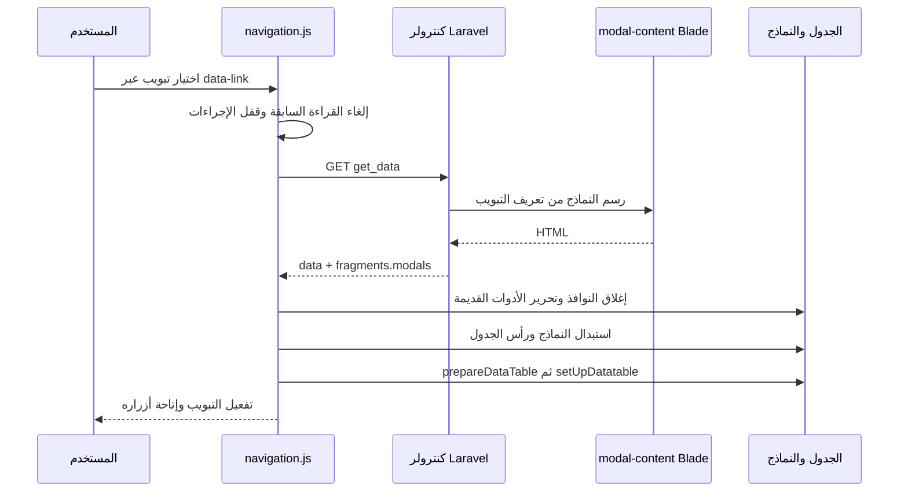

# شرح تعديلات الداشبورد بالكامل

هذا الدليل يشرح إعادة تنظيم JavaScript والكنترولرز، أداة إنشاء صفحات جديدة، وإصلاح نماذج الجداول داخل تبويبات التفاصيل. مصدره الملفات الفعلية والاختبارات الموجودة في هذا المشروع. ابدأ به لفهم النظام، ثم افتح مرجع الدوال عند تعديل جزء محدد.

## 1. ما الذي تغير؟

| الجزء | قبل التعديل | الوضع الحالي | أين تقرأ الكود؟ |
| --- | --- | --- | --- |
| JavaScript المشترك | دوال النماذج والجداول والخرائط والرسوم مجمعة في أربعة ملفات كبيرة | مداخل صغيرة تستورد وحدات حسب المسؤولية مع الحفاظ على أسماء الاستدعاءات القديمة | [مرجع JavaScript](javascript-reference.md) |
| كنترولرز الشاشات القديمة | تجميع إعدادات الصفحة وتشغيل الجدول متكرر بين الكنترولرز | جزآن مشتركان، مع بقاء حقول المورد وشروطه وعملياته في كنترولره | [دليل الكنترولرز](controllers.md) |
| إنشاء صفحة جديدة | نسخ كنترولر ومسارات وحقول وتعديلها يدويًا | واجهة محلية أو أمر Artisan يولدان ملفات المورد من تعريف الحقول | [دليل المولّد](generator.md) |
| تبويبات التفاصيل | تغيير تعريف الجدول دون تغيير HTML نماذجه | كل رد يحمل تعريف الجدول ونماذج Blade الخاصة به؛ الواجهة تستبدلهما بالترتيب | [وحدات التبويبات](../../resources/js/back/item-tables/README.md) |
| الأحداث والطلبات المتأخرة | بعض الأحداث مرتبطة بالعناصر الموجودة وقت تحميل الصفحة فقط | أحداث مفوضة تدعم العناصر الجديدة، وقراءات قديمة تُلغى ولا تملأ نموذجًا بديلًا | [events.js](../../resources/js/back/forms/events.js)، [population.js](../../resources/js/back/forms/population.js) |
| التحقق والتوثيق | يصعب تحديد الأثر عند تغيير ملف كبير | اختبارات للعقود والسلوك، تجربة متصفح قابلة للإعادة، وشرح بجانب الدوال | [تقرير التحقق](verification.md) |

الداشبورد ما زال Laravel وBlade وjQuery وDataTables. تقسيم الملفات لا يعني تقليل الخصائص أو حذف الدوال؛ نقلت المسؤوليات إلى ملفات أصغر تربطها استيرادات واضحة.

## 2. كيف ترتبط ملفات JavaScript بالصفحات الفعلية؟

| صفحة أو مكوّن Blade | مدخل JavaScript | ما الذي يفعله؟ |
| --- | --- | --- |
| `dashboard.screen.table_view` | `page-table.js` | يقرأ تعريف الصفحة من JSON، ثم يهيئ الجدول والحقول الموجودة أصلًا في HTML |
| `dashboard.screen.item_view` | `item-table.js` | يقرأ مرشحات سجل التفاصيل ويبدأ تحميل تبويبات الجدول ديناميكيًا |
| تضمين السكربتات المشترك | `crud.js` و`datatable-init.js` عند استخدام الجدول | يسجل واجهات النماذج ومحرك الجدول التي تستعملها Blade |
| الصفحة الرئيسية | `home.js` | يجمع وحدات الرسوم والطلبات الخاصة بها |
| واجهة إنشاء الصفحة | `builder.js` | يجمع محرر الحقول والمعاينة وطلبات التوليد |

`page-table.js` و`item-table.js` يستوردان `table.js`. والأخير يستورد `crud.js` و`datatable-init.js` قبل نشر دوال الجدول على `window`. هذا ترتيب صريح يمنع استعمال دالة قبل تعريفها. Vite يتتبع الاستيرادات؛ لا تضف كل ملف فرعي منفصلًا إلى Blade.

بعض الأسماء مثل `window.prepareDataTable` و`window.create_item` و`window.edit_item` مقصودة لأنها عقد مع خصائص `data-call_function` في القوالب. أما الدوال المساعدة الداخلية فتستوردها الوحدة التي تحتاج إليها. تغيير اسم عام يستلزم تعديل مستهلكيه أيضًا.

المجلدات الأساسية:

- `forms/`: إرسال الطلبات، تعبئة الحقول، التحقق، الملفات، Select2، الأحداث والصفوف المتكررة.
- `tables/`: إعدادات الصفحة، الأعمدة، تهيئة الحقول، قواعد النماذج، وعمليات CRUD.
- `datatables/`: محرك DataTables، شريط الأدوات، أزرار الصفوف، الفلاتر والتصدير.
- `item-tables/`: التنقل بين تبويبات التفاصيل واستبدال نماذجها ورؤوسها.
- `home/`: الرسوم وطلبات الإحصاءات.
- `builder/`: واجهة وصف المورد وطلب معاينة الملفات وإنشائها.

استُخرج JavaScript التنفيذي من صفحات الإعدادات والمحادثة وتسجيل الدخول والصفحة الرئيسية إلى `resources/js/back/pages` و`home.js`. أصبحت Blade ترسم HTML وتضع بياناتها ومساراتها وترجماتها داخل عناصر `application/json` فقط، ثم تقرأها الوحدة المختصة. هذا يمنع إعادة تركيب HTML من نص الرسالة، ويجعل تهيئة Quill وحالة تحميل تسجيل الدخول قابلة لإعادة الاستخدام والاختبار.

## 2.1 واجهة Dashboard ودورة حياة المحتوى

توجد واجهة عامة واحدة باسم `window.Dashboard` في [dashboard.js](../../resources/js/back/core/dashboard.js). تجمع `forms` و`tables` و`datatables` و`fields` و`assets` و`lifecycle`. الأسماء القديمة مثل `prepareDataTable` و`edit_item` باقية كطبقة توافق لأن قوالب Blade الحالية تستدعيها، بينما تستورد الوحدات الجديدة وظائفها مباشرة.

عند تركيب محتوى ثابت أو تبويب جديد يطلق النظام `dashboard:content-mounted`. وقبل استبدال مودالات التبويب يطلق `dashboard:content-unmounted` وينفذ دوال التنظيف المسجلة. التنظيف يشمل DataTables وSelect2 وDropzone والخرائط والمحررات حتى لا تتكرر النسخ أو تبقى listeners مرتبطة بعناصر حُذفت.

[AssetLoader](../../resources/js/back/core/assets.js) يسجل كل مكتبة باسم ثابت، يشارك نفس Promise بين الطلبات المتزامنة، ويحمل CSS ثم JavaScript بالترتيب. إذا فشل التحميل يمسح حالة الطلب ليسمح بالمحاولة التالية. يرسل Laravel مصفوفة `assets` مع تعريف الصفحة والتبويب، ويستنتجها [DashboardAssetResolver.php](../../app/Support/Dashboard/DashboardAssetResolver.php) من أنواع الحقول الحالية.

| نوع الحقل أو الصفحة | الأصل المطلوب |
| --- | --- |
| جدول server-side | `datatable` |
| نطاق تاريخ | `daterangepicker` |
| علاقة ثابتة أو endpoint | `select2` |
| صور وملفات | `dropzone` |
| محتوى HTML | `quill` |
| نقطة موقع | `googleMaps` |
| حدود جغرافية | `leaflet` |

مفتاح Google Maps يُقرأ من `GOOGLE_MAPS_BROWSER_KEY` عبر `config/services.php` ولا يوجد داخل Blade. منطق حفظ العلاقات وpivot، وتخزين الصور، وقواعد الخرائط، والمزادات والمحافظ والمدفوعات يظل داخل Controller أو Service الخاص بالمشروع.

## 2.2 Renderer واحد لحقول المودالات

لم يعد [modal-content.blade.php](../../resources/views/dashboard/admin-components/modal-content.blade.php) يحتوي ثلاث نسخ من شروط أنواع الحقول. هو يحدد مودالات الإضافة والتعديل والمودالات المخصصة فقط، ثم يمرر حقول كل نموذج إلى `modal-fields/field.blade.php`. يحول هذا الملف اسم النوع إلى partial داخل `modal-fields/types`.

لإضافة نوع جديد، أنشئ `modal-fields/types/{input}.blade.php` مرة واحدة؛ سيعمل تلقائيًا مع `inputs` و`update_inputs` و`modals.*.inputs`. توجد أسماء المتغيرات ومثال كامل في [دليل renderer](../../resources/views/dashboard/admin-components/modal-fields/README.md).

فلاتر `table_view` تستخدم نفس الفكرة في `table-filters/types`. الأنواع الفعلية المطلوبة هي `single` و`text` فقط؛ `text` يغطي HTML input types مثل number وdate. لم تُنسخ أنواع الصور والخرائط والمحررات إلى الفلتر لأنها لا تملك عقد فلترة Backend في المشروع. راجع [دليل فلاتر الجداول](../../resources/views/dashboard/admin-components/table-filters/README.md) قبل إضافة نوع جديد.

## 3. ماذا تغير في الكنترولرز؟

الكنترولر القديم يظل المكان الذي يحدد المورد وحقوله وعلاقاته وعمليات العمل. استخرج التكرار المشترك إلى:

| الدالة | مسؤوليتها | ما الذي تتركه للكنترولر؟ |
| --- | --- | --- |
| `dashboardPageSections()` | تجمع العنوان والفلاتر والإحصاءات والأعمدة ونماذج الإنشاء والتعديل وأفعال الصفوف | تعريف كل قسم وتعديلاته الخاصة بالدور |
| `dashboardPageData($sections, $extra)` | تربط الأقسام بالأعلام والصلاحيات والمسارات الحالية | الإضافات مثل النوافذ والخرائط والحقول الخاصة بالشاشة |
| `dashboardTableData($request, $columns, …)` | تربط استعلام المورد بخدمة البحث والتصفية والترتيب والترقيم | `initializeDataTableQuery` وشروط التصفية الخاصة بالمورد |
| `preprocessFilters()` | التطبيق الافتراضي يمرر المرشحات للمسارين العام والمخصص | يمكن تخصيصها لاستبعاد مرشح تتولاه الشاشة بنفسها |
| `applyCustomFilters()` | نقطة تخصيص افتراضية لا تضيف شروطًا | قيود المورد التي لا تعالجها الخدمة المشتركة |
| `dashboardTabResponse($data)` | تعيد تعريف التبويب ومعه HTML نماذجه المرسوم فعليًا | حساب `$data` ومرشحات التبويب قبل الاستجابة |

الملفان هما [BuildsDashboardPage.php](../../app/Http/Controllers/Admin/Concerns/BuildsDashboardPage.php) و[HandlesDashboardTable.php](../../app/Http/Controllers/Admin/Concerns/HandlesDashboardTable.php). تستخدمهما 44 شاشة من الكنترولرز القديمة. بعض نماذج التعديل المتطابقة تعيد استخدام حقول الإضافة بدل تكرار نفس التعريف، بينما تظل النماذج المختلفة مستقلة.

ترتيب حساب الأقسام ثم تعديل روابط الدور ثم تجميع الصفحة له أثر على شاشات الشركة والمسؤول؛ لذلك احتفظت الدوال المشتركة بترتيب العمليات، واختُبر ذلك بمقارنة قبل/بعد. لم توحد عمليات المزادات أو الدفع أو المحافظ أو الإشعارات في عملية CRUD عامة.

هناك فرق أساسي بين هذه المسارات:

| الدالة | طريقة HTTP الحالية | ماذا تعيد؟ | من يستخدمها؟ |
| --- | --- | --- | --- |
| `index` | GET | صفحة Blade كاملة | فتح شاشة المورد |
| `get_data` أو `get_data_buyer` | GET | تعريف الجدول وحقوله ونماذجه | التنقل بين تبويبات التفاصيل |
| `get_datatable` | POST | صفوف البيانات والأعداد و`draw` | DataTables عند البحث أو الترتيب أو تغيير الصفحة |
| `get_single_item` | GET | بيانات سجل واحد | تعبئة نموذج التعديل أو نموذج مخصص |
| `store` / `update` | POST | نتيجة حفظ بيانات السجل | إرسال نموذج الإضافة أو التعديل |

لا تضع مسار `get_datatable` في `data-link` الخاص بالتبويب، لأن استجابة الصفوف لا تحتوي على تعريف النماذج.

## 4. لماذا كان زر الإضافة أو التعديل يتوقف داخل التفاصيل؟

السطر التالي ينفذه Laravel أثناء رسم الصفحة على الخادم:

```blade
@include('dashboard.admin-components.all-modals', $data)
```

عند الضغط على تبويب، JavaScript يطلب JSON ويغيّر الجدول داخل الصفحة الموجودة بالفعل. المتصفح لا يشغّل Blade، ولا يعيد تنفيذ `@include` بمجرد تغيير التبويب. لذلك كان يتغير `store_url` و`update_url` وتعريف الحقول في JavaScript، بينما نماذج HTML الخاصة بالتبويب الجديد غائبة أو غير متزامنة معه.

وكان `all-modals` نفسه يضع المحتوى داخل `@push('modals')`. استدعاء `render()` عليه مباشرة في رد AJAX لا يحل المشكلة وحده، لأن المحتوى مدفوع إلى stack تحتاج صفحة كاملة إلى طباعته.

الحل يستخدم قالب نماذج واحدًا بطريقتين:

1. [modal-content.blade.php](../../resources/views/dashboard/admin-components/modal-content.blade.php) يرسم النماذج مباشرة من `$data`، دون stack أو سكربت تهيئة مستقل.
2. [all-modals.blade.php](../../resources/views/dashboard/admin-components/all-modals.blade.php) يظل غلاف `@push('modals')` للصفحات الكاملة ويستدعي القالب نفسه.
3. `dashboardTabResponse` يرسم `modal-content` مباشرة ويضيف النتيجة تحت `fragments.modals` في رد التبويب.
4. [item_view.blade.php](../../resources/views/dashboard/screen/item_view.blade.php) يحتوي مضيفًا ثابتًا باسم `dashboard-item-table-modals`. يستبدل JavaScript محتواه لكل تبويب ناجح.

بهذا لا نحتاج نسختين من تعريف الحقول، ولا نجمع نماذج كل التبويبات في الصفحة بمعرفات مكررة.

## 5. دورة تبديل التبويب خطوة بخطوة



التفاصيل موجودة داخل [navigation.js](../../resources/js/back/item-tables/navigation.js):

1. يلغي `AbortController` طلب تعريف سابق، وتلغى قراءات السجلات المرتبطة بالنماذج القديمة.
2. تقفل إجراءات الجدول والنماذج مؤقتًا بواسطة `inert` مع رسالة تحميل. روابط التبويبات تظل متاحة لاختيار طلب أحدث.
3. يتحقق من حالة HTTP ومن وجود تعريف صالح و`fragments.modals` قبل تغيير الشاشة الحالية.
4. ينتظر إغلاق النوافذ القديمة وانتهاء حركة Bootstrap والخلفية. يفحص إلغاء الطلب مرة ثانية بعد الانتظار حتى لا يثبت تبويبًا تجاوزه طلب أحدث.
5. يدمر Select2 وDropzone وjQuery Validate ونسخ Bootstrap التابعة للمضيف القديم قبل إزالة عناصرها. ثم يلغي قراءة صفوف الجدول السابق ويدمر مثيله.
6. يستبدل HTML بالكامل، وينشر تعريف التبويب الجديد على `window`، ويبني رؤوس الأعمدة، ثم يهيئ DataTables والحقول وقواعد التحقق.
7. يغيّر الرابط النشط بعد نجاح التركيب ويفك القفل. رد سابق لا يملك حق تغيير حالة تحميل طلب أحدث.

فشل HTTP أو غياب النماذج من الاستجابة يحدث قبل التدمير، فيبقى الجدول السابق ويظهر سبب الفشل. هذا الوصف لا يعني وجود استرجاع كامل للجدول إذا تعطلت مكتبة أثناء تهيئة الأدوات بعد بدء الاستبدال؛ ملفات القالب المطلوبة يجب أن تكون متاحة.

## 6. كيف تعمل الإضافة والتعديل بعد التبديل؟

عند الإضافة، زر DataTables يستدعي `show_add_modal` لفتح `add_modal`. النموذج الحالي يستخدم `create_item`، التي تجمع `FormData` وترسل إلى `window.store_url` الخاص بالتبويب المثبت حاليًا.

عند التعديل، زر الصف يستدعي `edit_item` بمعرف السجل. تجلب `populateFormFromAjax` بياناته من `get_single_item`، وتمسح وتملأ نفس عنصر `edit_form` الذي بدأ الطلب. يرسل `update_item` الحفظ إلى مسار `update_url` بعد استبدال رمز المعرف. قواعد التحقق تخص `update_inputs` لهذا التبويب.

النوافذ المخصصة لها `form_id` و`inputs` ومسار حفظ مستقل. أفعال الصفوف التي تملأ نافذة مخصصة تستخدم نوع `custom_modal` و`form_id` في تعريف الإجراء؛ لا تفترض أن مجرد اسم نافذة يحدد نموذج التعبئة. راجع [actions.js](../../resources/js/back/datatables/actions.js) وقالب [النوافذ المشتركة](../../resources/views/dashboard/admin-components/modal-content.blade.php).

### لماذا لا تؤثر الاستجابات القديمة على تبويب جديد؟

- تحتفظ قراءة السجل بهوية عنصر `form`، وتتحقق أنه متصل بالصفحة وأنه ما زال صاحب أحدث طلب. وجود نموذج جديد بنفس `id` لا يجعله نفس العنصر.
- إلغاء القراءة لا يلغي عملية حفظ POST بدأت بالفعل. عند انتهاء الحفظ، يحدث الكود واجهته الأصلية فقط إذا ظل النموذج ومثيل الجدول هما الحاليين.
- تفوض أحداث `submit` و`change` و`hide.bs.modal` إلى document مع أسماء نطاقات للأحداث؛ العناصر الجديدة تعمل دون تكرار التسجيل أو حذف مستمعي أجزاء أخرى.
- حقول تحديد الصلاحيات تعمل داخل نموذجها فقط، وقواعد الإضافة والتعديل والنوافذ المخصصة مستقلة.
- [closeModal](../../resources/js/back/forms/modal-lifecycle.js) ينتظر حركة فتح/إغلاق Bootstrap. إذا انتهى الحفظ قبل ظهور النافذة بالكامل، يعيد طلب الإغلاق عند `shown.bs.modal` وينظف المستمعين عند `hidden.bs.modal`.

لا تزل فحوص هوية النموذج أو التبويب بحجة أن المعرف النصي ثابت؛ هي التي تمنع ردًا متأخرًا من مسح بيانات كتبها المستخدم في تبويب آخر.

## 7. كيف أضيف أو أعدل شاشة بعد ذلك؟

### تعديل شاشة قديمة

ابدأ من كنترولر المورد، لا من JavaScript العام. غيّر `show_list()` لأعمدة العرض، و`inputs_list()` للإضافة، و`update_inputs_list()` للتعديل، و`filters()` للمرشحات. عند إضافة حقل محفوظ، راجع أيضًا تحقق Laravel و`store/update` وإعدادات الموديل وأعمدة قاعدة البيانات. إضافة مدخل في Blade وحدها لا تنشئ عمودًا في قاعدة البيانات.

لإتاحة كنترولر قديم داخل تبويب، يجب أن توجد دالة فعلية ومسار مسجل لها؛ في الكنترولرز التي تستعمل `BuildsDashboardPage` ونفس `successResponse`:

```php
/** يعيد تعريف هذا التبويب ونوافذه لصفحة التفاصيل. */
public function get_data()
{
    return $this->dashboardTabResponse($this->prepareData());
}
```

اربط مسار هذه الدالة في `$data['tabs']` الخاص بصفحة التفاصيل. لا تضف مسارًا ثانيًا إذا كان `all_routes()` سجله بالفعل. إنشاء اسم route وحده لا ينشئ دالة كنترولر مفقودة. تعريفات التبويبات الحالية موجودة في `UserController::show` و`AuctionController::show`؛ مرجع الكنترولرز يسرد المسارات التي تم إصلاحها واختبارها.

### إنشاء شاشة جديدة من الواجهة

1. جهّز بيئة Laravel المحلية واعتماداتها، ثم فعّل `DASHBOARD_BUILDER_ENABLED=true` مع `APP_ENV=local`.
2. سجل دخول الأدمن وافتح `/admin/dashboard-builder` من اتصال محلي.
3. املأ اسم الموديل، مقطع المسار، مفتاح الصلاحية، عنوان الصفحة والحقول وأنواعها.
4. اطلب المعاينة. تعرض الواجهة أسماء الملفات ونصوصها والتعارضات قبل الكتابة.
5. نفذ الإنشاء؛ تربط بصمة المحتوى العملية بالتعريف الذي تمت معاينته، فلا تنشئ مراجعة قديمة بعد تغيير الحقول.
6. نفذ خطوات Migration وSeeder التي تعرضها النتيجة عند الحاجة، ثم امنح الصلاحيات للدور المناسب.

للمورد الجديد ينشئ المولّد كنترولرًا صغيرًا وملف routes وتعريف JSON وSeeder للصلاحيات، ومعهما Model وMigration إذا طلبت إنشاء موديل جديد. استخدام موديل موجود لا ينشئ جدوله مرة أخرى. ملفات routes داخل `routes/admin-generated/` تحمل تلقائيًا من `routes/dashboard-tools.php` ضمن مجموعة admin.

الأداة لا تستبدل ملفًا موجودًا ولا تشغل Migration تلقائيًا. موارد العلاقات ورفع الملفات وتدفقات العمل المتخصصة تحتاج تخصيصًا في الكنترولر. المولّد الحالي ينشئ شاشة CRUD كاملة؛ لا يضيفها تلقائيًا كتَبويب داخل صفحة تفاصيل أخرى. التفاصيل والأمثلة وأدوار الخدمات في [دليل المولّد](generator.md).

## 8. ما الإصلاحات الأخرى التي صاحبت إعادة التنظيم؟

إلى جانب إصلاح التبويبات، شملت النسخة السابقة عزل قواعد نماذج الإنشاء والتعديل، تنظيف فلاتر تبويب سابق، ضمان نشر واجهات الجدول قبل إعلان الجاهزية، منع إرسال المفتاح المخصص مرتين، إزالة الاعتماد على `event` أو `$obj` غير الممررين، وتصحيح `populateForm` ليقرأ المعرف من البيانات.

الصفحات المولدة تصرح بأنواع حقولها على النموذج، حتى يعامل اسم مثل `image` كحقل نصي إذا كان هذا نوعه المعلن. استجابات أخطاء admin تستخدم عقد Laravel للحقول والصلاحيات وCSRF. تقرير التحقق يميز هذه التعديلات عن منطق الأعمال القديم الذي لم يكن هدفًا لإعادة الكتابة.

## 9. هل تم التحقق فعلًا؟

نعم. توجد اختبارات قابلة للإعادة ونتيجة متصفح مسجلة، إضافة إلى مقارنة الملفات المنقولة بالمصدر الذي اختُبر. راجع [تقرير التحقق](verification.md) للأعداد الحالية وتاريخ إعادة الفحص والأوامر.

التغطية تشمل منطق الوحدات، تحميل مسارات Laravel، رسم Blade الفعلي، التوليد وCRUD في SQLite معزول، وتكامل JavaScript الحقيقي مع Bootstrap/DataTables/Select2/Validate في Chrome. تجربة المتصفح الخاصة بالتبويبات تستخدم خادم بيانات محاكاة؛ لا تستخدم قاعدة المشروع الفعلية.

لا تعني هذه النتائج اختبار كل عملية دفع أو مزاد أو بريد أو خريطة أو رفع ملف داخل كل شاشة على بيانات تشغيل. كذلك لا يشمل مجموع اختبارات الداشبورد ملف Laravel التجريبي القديم `ExampleTest.php`. هذه الحدود مذكورة لتعرف بالضبط ما تثبته النتيجة، وما يحتاج تجربة داخل بيئة عملك عند تجهيزها.

## 10. أين أجد الشرح داخل الملفات؟

فوق الدوال توجد تعليقات عربية تشرح الغرض والمدخلات والقيمة المعادة والأثر على DOM أو الطلب أو قاعدة البيانات بحسب الدالة. بجانب الخطوات الحساسة توجد تعليقات تشرح سبب ترتيبها، مثل الانتظار قبل إزالة نافذة أو فحص الطلب بعد اكتمال حركة الإغلاق.

استخدم الملفات بهذا الترتيب عند التعلم:

1. هذا الدليل لفهم التعديلات وعلاقة الأجزاء.
2. [مرجع JavaScript](javascript-reference.md) لاختيار الملف والدالة المناسبة لكل تعديل.
3. [مرجع الكنترولرز](controllers.md) لفهم تعريف المورد وتشغيل الجدول.
4. [مرجع التبويبات](../../resources/js/back/item-tables/README.md) لعقد JSON وHTML ودورة الاستبدال.
5. [دليل المولّد](generator.md) لبناء شاشة جديدة وتخصيص الملفات الناتجة.
6. [تقرير التحقق](verification.md) و[اختبار المتصفح](../../tests/Browser/README.md) لإعادة الفحص بعد أي تغيير.
