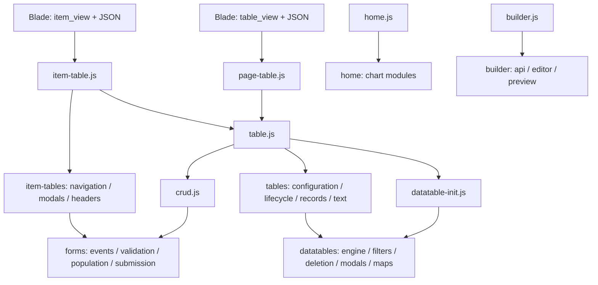

# مرجع JavaScript للداشبورد

هذا المرجع يشرح الكود الذي تستخدمه صفحات Laravel بالفعل في `resources/js/back`. ابدأ بـ[شرح التغييرات الكامل](CHANGES-EXPLAINED.ar.md)، ثم استخدم هذا الملف للوصول إلى الوحدة المسؤولة عن السلوك المطلوب. شرح المدخلات والنتيجة والآثار على الصفحة موجود أيضًا في JSDoc بالعربية بجوار كل دالة مسماة، بما فيها المعالجات الداخلية المهمة.

الفكرة العملية: الكنترولر يصف الصفحة والحقول والروابط؛ Blade يرسم HTML ويضع تعريف البيانات؛ JavaScript يقرأ التعريف ويربط الجدول والنماذج. إضافة صفحة معتادة لا تحتاج نسخ `crud.js` أو `table.js`. لإنشاء مورد جديد من واجهة، راجع [المولد](generator.md)؛ ولتخصيص العرض أو سلوك الحقول، استخدم الوحدات أدناه.

## 1. ملفات الدخول الفعلية وترتيب التحميل

| ملف الدخول | من يحمّله؟ | العمل الذي يبدأه |
| --- | --- | --- |
| [crud.js](../../resources/js/back/crud.js) | shared includes، وكذلك صفحات تسجيل الدخول والرئيسية | ينشر 24 اسمًا عامًا ثم يضبط CSRF والأحداث والتحقق ونطاق الحجز. |
| [datatable-init.js](../../resources/js/back/datatable-init.js) | shared includes عند وجود جدول، ويستورده `table.js` | ينشر واجهات محرك الجدول والنوافذ والحذف والفلاتر والخريطة؛ يربط التاريخ والتحديد عند جاهزية الصفحة. |
| [table.js](../../resources/js/back/table.js) | استيراد ثابت داخل `page-table.js` و`item-table.js` | يستورد المدخلين السابقين، وينشر عمليات السجلات وإعداد الجدول، ثم يطلق `dashboard:table-api-ready`. |
| [page-table.js](../../resources/js/back/page-table.js) | `screen/table_view.blade.php` | `startPageTable()` يقرأ JSON من `#dashboard-table-definition` ثم ينفذ `prepareDataTable` و`setUpDatatable`. |
| [item-table.js](../../resources/js/back/item-table.js) | `screen/item_view.blade.php` | ينشر تحميل جداول التفاصيل وبناء رؤوسها، ثم يبدأ التنقل بين تبويباتها. |
| [home.js](../../resources/js/back/home.js) | `screen/home.blade.php` | `initializeDashboardCharts()` ينشئ الرسم السنوي والدائري والمتوسط اليومي عند `DOMContentLoaded`. |
| [builder.js](../../resources/js/back/builder.js) | `builder/index.blade.php` | يربط محرر تعريف المورد والمعاينة والإنشاء والاستيراد والتصدير. |

توجد ستة مسارات `back` مستدعاة مباشرة بـ`@vite`؛ `table.js` مدخل مشترك مستخدم بالاستيراد. كل ملفات الدخول السبعة مستخدمة. تكرار ظهور `crud.js` في القالب وفي استيراد آخر لا يعني تنفيذ الوحدة مرتين في الصفحة نفسها: المتصفح يدير استيرادات ES Modules بحسب عنوان الوحدة. لا تضف `<script>` مستقلًا لكل ملف فرعي.



الاستيرادات الثابتة تسجل واجهات `window` قبل تشغيل تهيئة الصفحة؛ ليست هناك حاجة إلى الانتظار بتأخير زمني تخميني حتى تظهر `prepareDataTable`. `page-table.js` و`item-table.js` يبدآن فورًا إذا كانت DOM جاهزة أو يسجلان مستمعًا واحدًا إذا كانت ما زالت تُحمّل. `home.js` يحتفظ بمستمع `DOMContentLoaded` التقليدي؛ استيراده المتأخر بعد الحدث ليس طريقة إعادة تهيئة الرسوم.

## 2. العقد بين Blade وJavaScript

### تعريف الشاشة وحالتها

[configuration.js](../../resources/js/back/tables/configuration.js) يقرأ روابط `datatable_url` و`get_single_item` و`store_url` و`update_url` و`delete_url` و`delete_all_url`، وقوائم `show_list` و`inputs` و`update_inputs` و`filters` و`datatable_actions` و`modals`، وأعلام إتاحة الأدوات. `prepareDataTable(data)` ينشر الحالة على `window` للتوافق مع القالب الحالي.

`all_permissions` يأتي من Blade؛ `buildTableConfiguration` يختار الصلاحيات المتاحة للشاشة، مع الحفاظ على حالة `open`. فحص JavaScript يتحكم في العرض فقط؛ يجب أن يرفض Laravel أي طلب غير مسموح حتى لو أرسله المستخدم مباشرة.

`optioanl_filter` اسم قديم مقصود الإبقاء عليه. يعاد تكوينه من `internal_filters` عند كل تعريف جديد، لذلك لا يرث تبويب إعدادات سابقه. في صفحات التفاصيل توجد أيضًا `internal_filter` لسياق السجل الأب؛ اقرأ [شرح التبويبات](../../resources/js/back/item-tables/README.md) قبل تغيير الاثنين. `pageTable` هو مثيل DataTables الحالي، و`myDropzone` مرجع أداة الملفات المستخدمة حاليًا.

### استدعاء دالة من القالب

```html
<form data-event_on="submit" data-call_function="create_item">
    <!-- حقول النموذج يرسمها Blade -->
</form>
```

`configureAjax()` يقرأ رمز CSRF من وسم meta في القالب ويرسله في ترويسة `X-CSRF-TOKEN` لطلبات jQuery؛ لا يعتمد المثال على حقل مخفي داخل هذا النموذج.

`defineEvents()` يفوض `click` و`keyup` و`submit` و`change` على `document`. عند وصول الحدث إلى عنصر مطابق، يستدعي `window[اسم_الدالة](event, $(element))`. المعالج مسؤول عن `event.preventDefault()` متى احتاج منع السلوك الأصلي. إضافة اسم جديد في `data-call_function` تستلزم استيراد الدالة وتسجيلها على `window` في مدخل الصفحة المناسب. تصدير دالة من ES Module وحده لا يجعلها دالة عامة.

التفويض يعمل مع النماذج التي يضيفها AJAX لاحقًا. أسماء الأحداث مثل `.dashboardFormActions` و`.dashboardCustomSwitch` و`.dashboardPermissions` تسمح بإزالة مستمع الوحدة نفسها قبل إعادة تسجيله، دون مسح مستمعي الوحدات الأخرى. تحديد كل الصلاحيات محصور في أقرب `form`؛ والمفتاح `.switch-input.custom` له مسار مستقل عن مفاتيح صفوف الجدول.

### الأسماء العامة المحفوظة

هذه واجهات توافق تستخدمها القوالب؛ لا تغير تهجئتها عند إعادة التنظيم. الأسماء الداخلية يمكن استيرادها من وحداتها دون إضافتها إلى `window`.

| من يسجلها؟ | أسماء `window` | التنفيذ |
| --- | --- | --- |
| `crud.js` | `resetTheForm`، `populateFormFromAjax`، `setFormData`، `populateIdField`، `populateForm` | [forms/population.js](../../resources/js/back/forms/population.js) |
| `crud.js` | `update_switch_val`، `customFunction`، `updatePassword` | [forms/submission.js](../../resources/js/back/forms/submission.js) |
| `crud.js` | `showToast`، `togglePageLoader` | [forms/feedback.js](../../resources/js/back/forms/feedback.js) |
| `crud.js` | `direction`، `formatDateAgo` | [forms/formatting.js](../../resources/js/back/forms/formatting.js) |
| `crud.js` | `resetMultiForm`، `addItemMultiForm`، `removeItemMultiForm` | [forms/repeaters.js](../../resources/js/back/forms/repeaters.js) |
| `crud.js` | `replaceUrlPlaceholder`، `replaceUrlPlaceholder_v2` | [forms/urls.js](../../resources/js/back/forms/urls.js) |
| `crud.js` | `updateSelect2Options`، `initializeSelect2` | [forms/select2.js](../../resources/js/back/forms/select2.js) |
| `crud.js` | `ajax_exe` | [forms/ajax.js](../../resources/js/back/forms/ajax.js) |
| `crud.js` | `defineFormValidation`، `validateSummerNotes` | [forms/validation.js](../../resources/js/back/forms/validation.js) |
| `crud.js` | `restrictInputToLanguageJQuery`، `restrictInputToLanguageInForm` | [forms/language-input.js](../../resources/js/back/forms/language-input.js) |
| `datatable-init.js` | `initializeDataTable` | [datatables/engine.js](../../resources/js/back/datatables/engine.js) |
| `datatable-init.js` | `replaceUrlPlaceholder`، `replaceUrlPlaceholder_v2` ← `replaceUrlPlaceholderV2` | [datatables/urls.js](../../resources/js/back/datatables/urls.js)؛ تعيد تسجيل نفس العقدين: تعديل الروابط المطابقة، أو إرجاع النص فقط. |
| `datatable-init.js` | `show_add_modal` ← `showAddModal`، `show_import_modal` ← `showImportModal` | [datatables/modals.js](../../resources/js/back/datatables/modals.js) |
| `datatable-init.js` | `closeFilterModal`، `clickFilterBadge`، `clearFilters` | [datatables/filters.js](../../resources/js/back/datatables/filters.js) |
| `datatable-init.js` | `deleteButton`، `initMap` | [deletion.js](../../resources/js/back/datatables/deletion.js)، [maps.js](../../resources/js/back/datatables/maps.js) |
| `table.js` | `prepareDataTable`، `setUpDatatable`، `destroyDataTable` | [configuration.js](../../resources/js/back/tables/configuration.js)، [lifecycle.js](../../resources/js/back/tables/lifecycle.js) |
| `table.js` | `edit_item` ← `editItem`، `fill_form` ← `fillForm`، `create_item` ← `createItem`، `update_item` ← `updateItem`، `delete_item` ← `deleteItem`، `update_val` ← `updateValue` | [tables/records.js](../../resources/js/back/tables/records.js) |
| `item-table.js` | `loadTableData`، `generateTableHeaders` | [navigation.js](../../resources/js/back/item-tables/navigation.js)، [headers.js](../../resources/js/back/item-tables/headers.js) |

المجموع 43 اسم دالة عام فريد من هذه المداخل؛ التسجيلات 24 + 10 + 9 + 2 مع تداخل اسمي مساعدي الروابط. `home.js` و`builder.js` لا يضيفان دوال إلى `window`. `notifySuccess` و`notifyError` و`config` ونصوص الترجمة تأتي من القالب ومكتباته، وليست دوال جديدة أنشأها التقسيم. `forms/maps.js` يصدّر `initMap(lat, lng, id)` داخليًا لتعبئة الموقع؛ الدالة العامة `window.initMap()` مختلفة وتخص خريطة الإضافة في `datatables/maps.js`.

## 3. دورة القراءة والحفظ وتبديل التبويب

عند التعديل، `edit_item` يبني الرابط ثم يستدعي `populateFormFromAjax(url, '#edit_form')`. الاستجابة المتوقعة هي `{ "data": { ...حقول السجل } }`. يحتفظ طلب GET بعنصر النموذج نفسه ومحدده؛ الطلب الأحدث على نفس النموذج يلغي سابقه. لا يسمح الرد بتعبئة عنصر بديل يحمل المعرف نفسه أو عنصر أزيل من الصفحة. `setFormData` يوزع القيم، ويحوّل الكائن المترجم الذي يحتوي `en` إلى حقول مثل `name_ar` و`name_en`.

قبل استبدال نماذج تبويب، يستدعي منسق التبويبات `cancelPendingFormPopulation(host)`. يقبل العنصر أو jQuery أو محددًا نصيًا، ويعيد عدد القراءات الملغاة داخل الحاوية أو على النموذج نفسه. القيمة الغائبة لا تلغي شيئًا. هذه API مستوردة من الوحدة وليست اسمًا عامًا في `crud.js`.

عند الحفظ، يبني `collectFormData` بيانات النموذج ويضيف الملفات المنتظرة التابعة له. `createItem` و`updateItem` يفوضان إلى `saveRecord`. يحتفظ الحفظ بمثيل الجدول والنموذج والملفات وقت الإرسال؛ إذا تغيّر التبويب قبل الرد، يظل طلب الحفظ قائمًا، وتتجاوز نتيجة النجاح تصفير واجهة التبويب الجديد. `customFunction` يطبق نفس الحماية على مسار النوافذ المخصصة. هذه الحماية مخصصة لنتائج حفظ النماذج؛ ليست سياسة إلغاء عامة لكل طلبات AJAX.

`closeModal(element)` يعيد `Promise<void>` ينتظر `hidden.bs.modal`. إن كانت النافذة ما زالت تُفتح، يعيد محاولة إغلاقها بعد `shown.bs.modal`. تنظف `finish` المستمعين والمؤقت؛ وعدم وصول الإغلاق خلال المهلة يرفض الوعد برسالة مفهومة. منسق التبويبات ينتظر ذلك قبل إزالة DOM. معالج نجاح الحفظ يطلب الإغلاق ويعالج فشله، بينما يجري تحديث الجدول وتصفير النموذج ضمن مسار النجاح نفسه.

أحداث مسح النماذج تعتمد على `reset-on-close`. التحقق الأمامي يعرض أخطاء الحقول؛ Laravel يظل مصدر قواعد الحفظ المعتمدة. مسار `ajax_exe` الافتراضي يعالج 422 و403، لكن تمرير `props.error` يستبدل معالج الخطأ الافتراضي بالكامل؛ انتبه لذلك عند إنشاء معالج إرسال جديد. `ajax_exe` يجدول الإرسال بعد 50 مللي ثانية ويعيد `void`، بينما `populateFormFromAjax` يعيد jqXHR قابلًا للإلغاء.

## 4. مرجع الدوال حسب المسؤولية

التوقيعات الكاملة وأنواع الوسائط والقيم المعادة موجودة في الملفات المرتبطة. الأسماء في الجدول تشمل الدوال الخاصة داخل الوحدة، فلا يفترض أن جميعها صالحة للاستدعاء من Blade.

### النماذج: النقل والأحداث والتحقق

| الوحدة | الدوال وما تفعله |
| --- | --- |
| [ajax.js](../../resources/js/back/forms/ajax.js) | `configureAjax()` يضبط CSRF؛ `ajax_exe(props)` يبني طلب jQuery مع FormData ومعالجات النجاح والخطأ والتحميل. callbacks `error` و`beforeSend` و`complete` موضحة عند إعداد الطلب. |
| [events.js](../../resources/js/back/forms/events.js) | `initializeFormPage()` يركز القائمة ويسجل قواعد التحقق؛ `resetModalForm()` يمسح نموذج `this`؛ `resetClosingModal(event)` يقصر المسح على النافذة الأصلية؛ `registerFormReady()` يسجلها ويمنع تكرار تهيئة الصفحة. |
| [events.js](../../resources/js/back/forms/events.js) | `submitCustomSwitch(event)` يرسل `{id,value}`؛ `registerSwitchReady()` يفوض مفاتيح `.custom`؛ `dispatchDeclaredAction(event)` يحل اسم دالة `window`؛ `defineEvents()` يسجل الأنواع الأربعة للأحداث دون تراكمها. |
| [events.js](../../resources/js/back/forms/events.js) | `permissionGroup($element)` يختار مجموعة الإنشاء أو التعديل؛ `toggleFormPermissions()` يغير مربعات نفس النموذج؛ `synchronizePermissionToggle()` يعكس حالة المجموعة على تحديد الكل؛ `registerPermissionReady()` يربط الاتجاهين بالتفويض. |
| [validation.js](../../resources/js/back/forms/validation.js) | `defineFormValidation(form, rules, messages, submithandler)` يركب jQuery Validate؛ `validateSummerNotes(summernotes, errors)` يعيد صلاحية المحررات ويبرز الفارغ. `highlight` و`unhighlight` يعدلان الحالة؛ `errorPlacement` يضع الرسالة بجانب الواجهة المرئية؛ `invalidHandler` يكشف أول خطأ. |
| [validation-errors.js](../../resources/js/back/forms/validation-errors.js) | `handleValidationErrors(errors, form, options)` يحول مثل `rooms.0.name` إلى `rooms[0][name]` ويعرض الرسائل؛ `scrollToElement($element)` يمرر إلى الحقل؛ `switchToTabWithError($element)` يفتح تبويبه ويعيد هل حدث تبديل. |
| [validation-rules.js](../../resources/js/back/forms/validation-rules.js) | `registerValidationRules()` يسجل القواعد والرسائل عند وجود الإضافة واللغة `ar`. القواعد المسماة: `greaterThan` و`greaterThanOrEqual` للأرقام؛ `filesize` و`maxFileCount` للملفات؛ `afterDate` و`afterOrEqualDate` و`beforeDate` و`beforeOrEqualDate` للمقارنة بين الحقول؛ `afterToday` للمقارنة باللحظة الحالية. تسجيل `greaterThan` المتكرر موجود في العقد السابق؛ مرحلة الشرح أبقته كما هو. |
| [submission.js](../../resources/js/back/forms/submission.js) | `update_switch_val(link, data)` يرسل تغييرًا صريحًا؛ `customFunction(event, $obj)` يرسل action/method النموذج مع ملفاته؛ `updatePassword(event, $obj)` يرسل كلمة المرور ويغلق ويصفر نموذجها. تعليقات callbacks تشرح آثار النجاح والفشل لكل عملية. |
| [modal-lifecycle.js](../../resources/js/back/forms/modal-lifecycle.js) | `closeModal(element)` ينتظر إغلاق Bootstrap؛ `finish(error)` ينظف الانتظار ويحسم الوعد؛ `onHidden()` ينهيه بالنجاح؛ `onShown()` يعيد طلب الإغلاق بعد اكتمال الفتح. |

### النماذج: تعبئة الحقول والإضافات

| الوحدة | الدوال وما تفعله |
| --- | --- |
| [population.js](../../resources/js/back/forms/population.js) | `resetTheForm(form)` يعيد القيم وحالة التحقق؛ `populateFormFromAjax(url, formSelector)` يقرأ السجل؛ `setFormData(data, formSelector)` يوزعه على الحقول والترجمات؛ `populateIdField(id, formId)` يكتب المعرف؛ `populateForm(data, formId)` غلاف لكتابة `data.id` فقط. |
| [population.js](../../resources/js/back/forms/population.js) | `isCurrentPopulation(entry)` يختبر هوية النموذج وأحدث طلب؛ `finishPopulation(entry)` ينهي حصة التحميل؛ `cancelPopulation(entry)` يبطل القراءة قبل `abort`؛ `cancelPendingFormPopulation(root)` يلغي قراءات الحاوية. callbacks الطلب تلتزم بنفس فحص الهوية. |
| [fields.js](../../resources/js/back/forms/fields.js) | `isDeclaredDashboardField(formSelector, key)` يفحص metadata المولد؛ `populateField(formSelector, key, value, data)` يختار التعبئة العادية أو الخاصة؛ `populateRegularField(...)` يعالج الحقول والكائنات المتداخلة والمصفوفات والمحررات؛ `populatePermissions(formSelector, value)` يحدد مربعات `key_name`. |
| [repeaters.js](../../resources/js/back/forms/repeaters.js) | `resetMultiForm(containerId, id)` يبقي الصف الأول ويمسحه؛ `addItemMultiForm(containerId, $id, defaultContainer)` ينسخ الصف ويحدث أسماء مصفوفة Laravel ومعرفات DOM؛ `addValidationForRow(containerId, rowIndex)` يسجل قواعد `data-validation` للصف؛ `removeItemMultiForm(btn)` يحذف الصف إن بقي آخر ولا يعيد ترقيم البقية. |
| [select2.js](../../resources/js/back/forms/select2.js) | `getNestedValue(obj, path)` يقرأ مسار علاقة؛ `updateSelect2Options(data, key, value, $element, formSelector)` يضيف خيارات السجل المحددة؛ `initializeSelect2(selector, options)` يدمج الاتجاه والإعدادات؛ `initSelect2(element, options)` يدمر النسخة السابقة قبل التركيب؛ `setupSelect2(options)` يركب قوائم الصفوف المتكررة وبحثها وعلاقاتها؛ `formatColorOption(state)` ينسق اللون حسب العقد القديم. |
| [media.js](../../resources/js/back/forms/media.js) | `populateCarousel(value)` يبني شرائح الصور؛ `populateImages(formSelector, value)` يعرض ملفات Dropzone المحفوظة ويسجل معرفات الحذف؛ `populateImage(formSelector, key, value)` يغير مصدر المعاينة؛ `populateVideo(formSelector, videoUrl)` يضيف الفيديو وعلامة الحذف اللاحقة؛ `removeVideoPreview()` يزيل المعاينة الحالية. |
| [maps.js](../../resources/js/back/forms/maps.js) | `populateBoundary(formSelector, key, value)` يعيد رسم حدود Leaflet من JSON؛ `updateCoordinates(layer)` الداخلية تكتب المضلع في الحقل؛ `initMap(lat, lng, id)` ينشئ موقع التعديل؛ `updateMarkerAndMap()` الداخلية تزامن إدخال الإحداثيات مع العلامة. |
| [feedback.js](../../resources/js/back/forms/feedback.js) | `showToast(type, text)` يعرض رسالة Bootstrap؛ `togglePageLoader(status, opacity)` يظهر أو يخفي أو يعكس المؤشر. عداد قراءات النماذج موجود في `population.js` وليس داخل هذا المساعد العام. |
| [language-input.js](../../resources/js/back/forms/language-input.js) | `restrictInputToLanguage(element, language)` يربط قيد ضغطات المفاتيح ويعيد خطأ للغة غير المدعومة؛ `restrictInputToLanguageJQuery($field, language)` يطبقه على مجموعة؛ `restrictInputToLanguageInForm(form, element_name, language)` يطبقه بالاسم داخل نموذج. هذا قيد إدخال، لا بديل للتحقق من البيانات. |
| [formatting.js](../../resources/js/back/forms/formatting.js) | `direction()` يعيد rtl/ltr من اللغة؛ `formatDateAgo(dateString)` يعيد تاريخًا مطلقًا بصيغة العرض وAM/PM؛ الاسم محفوظ لكنه لا يحسب «منذ ساعتين». |
| [urls.js](../../resources/js/back/forms/urls.js) | `replaceUrlPlaceholder(url, value)` يستبدل المعرف ويحدث href/action المطابقين؛ `replaceUrlPlaceholder_v2(url, value)` يعيد الرابط فقط؛ `isValidUrl(url)` يفحص صحة الرابط ونفس أصل الصفحة. |
| [date-range.js](../../resources/js/back/forms/date-range.js) | `initializeBookingRange()` يركب منتقي الحجز؛ `booking_range(start, end)` الداخلية تحدث النص. الافتراضي القديم هنا ستة أشهر قبل وبعد الآن؛ منتقي جدول DataTables له تهيئة أخرى في `datatables/filters.js`. |

النماذج المولدة تضع `data-dashboard-field-types` من تعريف الحقول. الاسم المعلن مثل `image` أو `lat` يعامل كحقل عادي وفق تعريفه، ولا يفترض تلقائيًا أنه صورة أو خريطة. عند غياب هذه metadata يبقى توجيه الأسماء القديمة؛ لهذا لا تنسخ منطق الصور والخرائط إلى نموذج مولد لمجرد تشابه اسم حقل.

### تعريف الجدول وعمليات السجلات

| الوحدة | الدوال وما تفعله |
| --- | --- |
| [configuration.js](../../resources/js/back/tables/configuration.js) | `getNestedValue(record, path)` يقرأ قيمة منقطة؛ `buildTableConfiguration(data, permissions)` يعيد حالة مستقلة؛ `prepareDataTable(data)` ينشرها على `window`. |
| [columns.js](../../resources/js/back/tables/columns.js) | `renderImageDescription(row, details)` يعرض الصورة والعنوان والوصف؛ `renderColumn(column, data, row)` يختار عرض النوع؛ `buildColumns(state)` يحفظ ترتيب أعمدة التحكم والتحديد والبيانات والإجراءات. callback `render` يربط DataTables بالعارض. |
| [text.js](../../resources/js/back/tables/text.js) | `escapeHtml(value)` يهرب النص؛ `renderToggleText(content, idPrefix, isHtml, limit)` يبني النص المختصر والكامل؛ `bindTextToggles()` يربط المزيد/أقل بالتفويض. |
| [select-options.js](../../resources/js/back/tables/select-options.js) | `buildSelectQuery(item, params, readValue)` يعيد query والعلاقات المطلوبة الناقصة دون DOM؛ `mapSelectResults(response, params)` يحول استجابة `{data: [...]}` إلى نتائج Select2 والتصفح. |
| [fields.js](../../resources/js/back/tables/fields.js) | `fieldElement(prefix, id)` يجد الحقل؛ `formatColorOption(id, state)` يبني نصًا أو معاينة لون؛ `initializeSelect(item, prefix, dropdownParent, colorOptions)` يركب القائمة والعلاقات؛ `initializeEditor(item, formName)` يزامن Quill مع الحقل المخفي؛ `initializeInputs(inputs, prefix, formName)` ينزل إلى صف multiform الأول؛ `initializeFields(state)` يهيئ الفلاتر وكل النماذج. |
| [validation.js](../../resources/js/back/tables/validation.js) | `collectValidationRules(inputs)` يجمع قواعد نموذج واحد وصفه المتكرر الأول؛ `initializeFormValidation(state)` يربط مجموعات مستقلة للإضافة والتعديل والنوافذ المخصصة. |
| [lifecycle.js](../../resources/js/back/tables/lifecycle.js) | `dataColumnIndexes(state)` يحسب فهارس أعمدة البيانات؛ `bindColumnVisibility(table)` يربط اختيار الأعمدة؛ `bindSwitchInputs()` يربط مفاتيح الصفوف ويستبعد `.custom`؛ `setUpDatatable()` ينشئ الأدوات أو يعيد المثيل الموجود؛ `destroyDataTable()` يدمر المثيل ويحرر مرجعه. |
| [records.js](../../resources/js/back/tables/records.js) | `editItem(event, object)` يملأ نموذج التعديل؛ `fillForm(event, object)` يملأ نموذج إجراء مخصص؛ `collectFormData(form)` يجمع الحقول والملفات أو يعيد null عند غياب ملف مطلوب؛ `saveRecord(event, form, update)` يوحد الحفظ؛ `createItem` و`updateItem` يغلفانه مع اختلاف الرابط وإعادة التحميل. |
| [records.js](../../resources/js/back/tables/records.js) | `deleteItem(link)` يرسل الحذف بعد تأكيد واجهة الإجراء؛ `updateValue(link, values)` يرسل تغيير قيمة مباشرًا. callbacks النجاح والخطأ توضح متى يعاد تحميل الجدول وكيف تعرض النتيجة. |

الأنواع الحالية في `renderColumn`: `text` و`html_text` و`button_url` و`bool` و`status` و`text_button` و`id` و`image` و`image_description` و`switch`. `text` يهرب النص، و`html_text` يحافظ على HTML المقصود من محرر الصفحة. تعريف نوع جديد يحتاج مراجعة مصدر البيانات في Laravel وعرض Blade إذا كان حقل إدخال أيضًا، وليس إضافة فرع العرض وحده.

### محرك DataTables وأدواته

| الوحدة | الدوال وما تفعله |
| --- | --- |
| [engine.js](../../resources/js/back/datatables/engine.js) | `readFilterElement(selector)` يقرأ العنصر وقت الطلب؛ `initializeDataTable(tableSelector, ajaxUrl, externalFilters, columns, actions, options)` ينشئ مثيل serverSide ويربط الفلاتر. `drawCallback` يهيئ القوائم بعد الرسم، و`ajax.data` يضيف filters إلى حمولة الطلب. |
| [actions.js](../../resources/js/back/datatables/actions.js) | `hasPermission(permission, permissions)` يختبر صلاحية أو أي عنصر بالقائمة؛ `isActionVisible(action, row, permissions)` يجمع التفويض وشروط `if`؛ `renderAction(action, row)` يرسم رابطًا أو نافذة أو زر حذف؛ `renderActions(...)` يرسم القائمة ويدعم renderer المخصص؛ `buildColumnDefinitions(actions, state)` يبني التحكم والتحديد والإجراءات. |
| [filter-values.js](../../resources/js/back/datatables/filter-values.js) | `buildRequestFilters(selectors, readElement, state)` يجمع قيم DOM أو `var[name]` أو نطاق التاريخ ثم يطبق الفلاتر الداخلية والفallback وفق حالة الصفحة. |
| [filters.js](../../resources/js/back/datatables/filters.js) | `closeFilterModal()` يغلق أدوات الفلاتر؛ `clearInput(input)` يمسح حقلًا؛ `placeFilterBadges()` يبني شارات مهربة؛ `clickFilterBadge(event, object)` يزيل فلترًا ويحدث الجدول؛ `clearFilters(event)` يفوض إلى زر الإلغاء؛ `bindFilterControls(table)` يربط التطبيق والمسح والنطاق دون تراكم. |
| [filters.js](../../resources/js/back/datatables/filters.js) | `displayDateRange(start, end)` يغير النص؛ `initializeDateRange()` يهيئ منتقي الجدول بافتراضي الاثني عشر شهرًا الحالي. |
| [deletion.js](../../resources/js/back/datatables/deletion.js) | `deleteButton(callback, url)` ينتظر SweetAlert ولا يستدعي callback عند الإلغاء؛ `deleteAll()` يجمع `ids[]` ويرسل POST؛ `bindRowSelection()` يفوض تحديد الكل والحذف الجماعي. |
| [toolbar.js](../../resources/js/back/datatables/toolbar.js) | `formatExportCell(value)` يستخلص نص الخلية ويعطي أولوية لاسم المنتج؛ `customizePrint(printWindow)` ينسق نافذة الطباعة؛ `exportButton()` يبني Print/CSV/Excel/Copy؛ `buildToolbarButtons(state)` يختار الأدوات وفق أعلام التعريف. callbacks `action` تفتح الاستيراد أو الإضافة أو تأكيد الحذف. |
| [modals.js](../../resources/js/back/datatables/modals.js) | `initializeCreateDropzone()` يعيد تركيب أداة ملفات الإضافة؛ `openCreateModal(modalId)` يفتح ويهيئ الأدوات؛ `showImportModal()` يفتح الاستيراد؛ `showAddModal()` يصفر multiform ثم يفتح الإضافة. |
| [maps.js](../../resources/js/back/datatables/maps.js) | `updateBoundaryCoordinates(layer)` يكتب مضلع الإضافة؛ `initializeBoundaryMap()` يهيئ Leaflet أو يصفر طبقات النسخة الحالية؛ `writeLocation(position)` يكتب lat/lng؛ `initMap()` يركب خريطة الإضافة المتاحة؛ `updateMarkerAndMap()` الداخلية تزامن الإدخال الصالح مع الخريطة. |
| [urls.js](../../resources/js/back/datatables/urls.js) | `replaceUrlPlaceholderV2(url, value)` يعيد النص بعد استبدال واحد؛ `replaceUrlPlaceholder(url, value)` يحدث أيضًا روابط ونماذج القالب المطابقة. |

### تبويبات التفاصيل

تفاصيل الترتيب والتعامل مع الفشل في [README التبويبات](../../resources/js/back/item-tables/README.md). هذه الوحدات جزء من المنظومة الفعلية، وتستدعي وحدات النماذج والجدول المشتركة بدل إعادة تعريفها.

| الوحدة | الدوال |
| --- | --- |
| [navigation.js](../../resources/js/back/item-tables/navigation.js) | `setTabLoading(loading, message)` يقفل أدوات الانتقال ويعرض الحالة؛ `loadTableData(link, activeLink)` يحمل ويثبت أحدث تعريف ونماذجه؛ `startItemTables()` يربط اختيار التبويبات ويبدأ التبويب الأول. |
| [modals.js](../../resources/js/back/item-tables/modals.js) | `prepareTabModals(result)` يفحص fragment ويجهز HTML البديل؛ `closeTabModals(host)` ينتظر إغلاق نوافذ المضيف؛ `disposeTabModals(host)` يحرر Dropzone وSelect2 والتحقق قبل إزالة النماذج. |
| [headers.js](../../resources/js/back/item-tables/headers.js) | `generateTableHeaders` يبني رؤوس الجدول المطابقة لـshow_list كنصوص؛ لا ينفذ أسماء الأعمدة كـHTML. |

### الرسوم البيانية

| الوحدة | الدوال وما تفعله |
| --- | --- |
| [year-chart-options.js](../../resources/js/back/home/year-chart-options.js) | `buildYearChartOptions(theme, data)` يعيد خيارات الرسم السنوي دون تركيب DOM؛ callback `formatter` يحتفظ بقيمة محور الرسم كما وردت. |
| [year-chart.js](../../resources/js/back/home/year-chart.js) | `initYearStatisticsChart()` ينشئ ApexCharts عند وجود `#yearStatisticsChart` ويربط اختيار الشهر. |
| [month-selection.js](../../resources/js/back/home/month-selection.js) | `setupMonthSelection(chart)` يربط قائمة الشهر؛ `fetchMonthDataFromLaravel(month, chart)` يرسل `POST /api/shipment-statistics` ويحدث الفئات والسلاسل والعنوان الفرعي. |
| [circle-chart.js](../../resources/js/back/home/circle-chart.js) | `initcircleChart(customData, theme)` ينشئ الرسم الدائري؛ `updatecircleChart(chart, newData)` يحدث السلاسل والعناوين؛ `fetchDataAndUpdateChart(chart)` يجلب `/api/delivery-exceptions` عند استدعائه صراحة. formatter النسبة والقيمة يستخدمان parseInt؛ formatter الإجمالي يعرض عنوان البيانات المرسل. |
| [daily-sales-chart.js](../../resources/js/back/home/daily-sales-chart.js) | `initAverageDailySalesChart(customData, theme)` ينشئ الرسم المصغر مع الافتراضيات؛ `updateAverageDailySalesChart(chartInstance, newData)` يحدثه؛ `fetchDailySalesDataAndUpdateChart(chartInstance)` يجلب `/api/average-daily-sales` عند استدعائه صراحة. |

مصادر البيانات والألوان موضحة في [README الرسوم](../../resources/js/back/home/README.md). لم تتحول نقاط جلب الرسوم الاختيارية إلى خدمات جديدة ضمن التقسيم؛ لا تنفذ طلبات الرسم الدائري والمتوسط تلقائيًا. وجود بيانات `circle_chart` مطلوب لمسار البداية الحالي.

### واجهة مولد الصفحات

| الوحدة | الدوال وما تفعله |
| --- | --- |
| [builder.js](../../resources/js/back/builder.js) | `initializeBuilder()` يربط الأزرار ويضيف صفًا أوليًا؛ `invalidate()` يزيد revision ويمسح preview؛ `setBusy(value)` يغير تعطيل الأزرار وinert للنموذج؛ `report(error)` يعرض الخطأ بنفس منطقة الحالة. |
| [api.js](../../resources/js/back/builder/api.js) | `sendDefinition(url, definition)` يرسل JSON مع CSRF ويعيد Promise بجسم الاستجابة أو يرمي Error يجمع أخطاء التحقق. |
| [editor.js](../../resources/js/back/builder/editor.js) | `readControl(control)` يعيد boolean للمربع أو النص المشذب؛ `readDefinition(form)` يجمع إعدادات المورد وحقوله؛ `addField(container, field, invalidate)` ينسخ القالب حتى حد 40 حقلًا؛ `numberFields(container)` يحدث الترقيم المرئي. |
| [editor.js](../../resources/js/back/builder/editor.js) | `fillDefinition(form, definition, invalidate)` يستبدل محتوى المحرر بعد فحص بنية fields؛ `downloadDefinition(definition)` يبدأ تنزيل JSON عبر Blob ويحرر عنوانه. |
| [preview.js](../../resources/js/back/builder/preview.js) | `renderFiles(files)` يعرض مسار ومحتوى كل ملف باستخدام textContent؛ `renderNextSteps(steps)` يعرض الخطوات والأوامر كنص؛ `showStatus(message, error)` يظهر الرسالة ويضبط نمطها. |

الإنشاء يعتمد على **نفس تعريف المعاينة والبصمة التي أعادها الخادم**. أي تعديل يبطل المعاينة؛ رقم revision يمنع عرض رد معاينة أقدم من البيانات الحالية. واجهة المتصفح لا تنشئ PHP بنفسها، ولا تشغّل أوامر migration المكتوبة في الخطوات. الاستيراد يفحص الحجم وبنية الصفوف في المتصفح؛ فحص الأسماء والأنواع والمسارات والتعارضات وكتابة الملفات مسؤولية Laravel. التفاصيل في [generator.md](generator.md).

## 5. أين أعدل السلوك المعتاد؟

| المطلوب | البداية المناسبة |
| --- | --- |
| إضافة صفحة CRUD عادية | واجهة المولد أو تعريف المورد ثم [دليل المولد](generator.md)، مع إبقاء JavaScript المشترك. |
| تغيير عرض نص أو صورة أو حالة في الجدول | `tables/columns.js`؛ اختصار النص وتهريبه في `tables/text.js`. |
| إضافة حقل للنموذج فقط | تعريف inputs أو fields من Laravel وقالب إدخال Blade؛ لا تعدل entry لمجرد إضافة حقل. |
| تغيير طريقة تعبئة نوع حقل | `forms/fields.js` ثم وحدة الوسائط أو الخريطة أو Select2 عند الحاجة. |
| تعديل بحث قائمة مرتبطة | `tables/select-options.js` لمعاملات الطلب و`tables/fields.js` للربط؛ صفوف multiform القديمة تستخدم أيضًا `forms/select2.js`. |
| تعديل قواعد تحقق واجهة | تعريف القواعد أولًا؛ `tables/validation.js` لتجميعها، و`forms/validation.js` لشكل العرض، و`validation-rules.js` لقاعدة مخصصة. |
| تغيير صيغة فلاتر الطلب | `datatables/filter-values.js`؛ تركيب ومحو الشارات في `datatables/filters.js`. |
| إضافة زر إجراء لنوع صفحة | `datatable_actions` من تعريف الكنترولر؛ `datatables/actions.js` فقط إن احتجت نوع عرض عام جديد. |
| إرسال نموذج مخصص | `forms/submission.js` أو وحدة مستقلة يستوردها المدخل؛ راع هوية النموذج إذا كان يستبدل عبر التبويبات. |
| تغيير الانتقال بين جداول التفاصيل | `item-tables/navigation.js` و`modals.js`؛ `forms/modal-lifecycle.js` لانتظار Bootstrap. |
| تغيير ألوان وخيارات رسم | الوحدة المقابلة في `home/` أو مصدر `config` في القالب. |
| إضافة نوع حقل للمولد | واجهة builder ليست كافية وحدها؛ حدث قبول النوع وتوليده والتحقق منه في Laravel وفق [دليل المولد](generator.md). |

## 6. المكتبات وحدود العمل الحالي

هذه الوحدات تعتمد على المكتبات التي تحملها shared includes: jQuery وjQuery Validate وBootstrap وDataTables، وعلى Select2 وQuill وDropzone وMoment/daterangepicker وSweetAlert وApexCharts أو الخرائط حسب نوع الصفحة. تقسيم الكود لم يستبدل هذه المكتبات ولم يضف حزمًا جديدة. `resources/js/app.js` وملفات `public/dashboard` ومسارات JavaScript خارج `back` تقع خارج تقسيم هذه المجموعة.

أصبحت الصفحات التالية تمرر البيانات داخل `application/json` وتشغّل وحدة مستقلة:

| موضع Blade | ما تبقى فيه |
| --- | --- |
| [admin-main-layout](../../resources/views/dashboard/layout/admin-main-layout.blade.php) و[shared scripts](../../resources/views/dashboard/layout/parts/admin-include-scripts.blade.php) | نصوص اللغة والإعدادات، تحميل مكتبات القالب، اتجاه Select2، إشعارات الجلسة وبعض ربط المحادثات. |
| [home](../../resources/views/dashboard/screen/home.blade.php) | `home.js` يقرأ بيانات الرسوم من JSON. |
| [login](../../resources/views/dashboard/screen/login.blade.php) | `pages/login.js` يرسل النموذج ويعيد حالة زر التحميل في النجاح والفشل. |
| [settings_view](../../resources/views/dashboard/screen/settings_view.blade.php) | `pages/settings.js` يملأ القيم ويهيئ Quill بعد تحميله. |
| [chat_view](../../resources/views/dashboard/screen/chat_view.blade.php) | `pages/chat.js` يرسل ويستقبل الرسائل ويبني عناصرها عبر DOM الآمن. |
| [update-password](../../resources/views/dashboard/admin-components/update-password.blade.php) و[auth-layout](../../resources/views/dashboard/layout/auth-layout.blade.php) | فتح نافذة كلمة المرور وإشعارات الجلسة. |

`<script type="application/json">` يحمل بيانات فقط ولا ينفذ JavaScript. بقيت في القوالب المشتركة تهيئة مكتبات القالب وإشعارات الجلسة، أما منطق الصفحات المذكورة فانتقل إلى وحداته.

### Core وواجهة التوافق

| الوحدة | المسؤولية |
| --- | --- |
| `core/dashboard.js` | ينشئ `window.Dashboard` ويسجل مجموعات API وaliases القديمة في موضع واحد. |
| `core/config.js` | يقرأ JSON الخاص بالصفحة وإعدادات التشغيل. |
| `core/assets.js` | يسجل الأصول ويحملها مرة واحدة ويدعم إعادة المحاولة بعد الخطأ. |
| `core/lifecycle.js` | يعلن mount/unmount ويربط دوال تنظيف بجذر المحتوى. |
| `forms/dropzones.js` | يحتفظ بنسخة Dropzone مستقلة لكل عنصر ويدعم جمع الملفات وتدمير النسخ حسب الحاوية. |
| `forms/editors.js` | يدير نسخ Quill ويزامن المحتوى مع الحقل المخفي. |
| `forms/maps.js` | يوفر adapters مستقلة لنقطة Google Maps وحدود Leaflet مع دعم أكثر من خريطة. |

## 7. التحقق وكيف تكرره

من جذر المشروع:

```sh
npm run test:dashboard
npm run build
```

| الاختبارات | ما تثبته |
| --- | --- |
| `forms-contract` و`forms-charts` | الأسماء العامة قبل DOM-ready، تعبئة البيانات والتنسيق وقواعد الإدخال وخيارات وتحديث الرسوم. |
| `forms-dynamic-events` و`forms-switch-integration` | النماذج الجديدة تعمل بالتفويض، عزل تحديد الصلاحيات، وعدم ازدواج طلب المفتاح المخصص. |
| `forms-async-lifecycle` و`modal-lifecycle` | تجاهل القراءة القديمة وإلغاء قراءات الحاوية، تجاهل آثار حفظ تبويب مستبدل، وانتظار إغلاق Bootstrap. |
| `forms-generated-fields` | الحقول المعلنة لا تتحول إلى أدوات صور أو خرائط بسبب أسمائها وحدها. |
| `tables-logic` و`tables-runtime` | تكوين الحالة والأعمدة والفلاتر والصلاحيات وربط الإضافات وعقود عمليات الجدول. |
| `page-tables` | بدء الصفحة والتبويبات، ترتيب التعريف والنماذج، وأحدث نتيجة في التنقل. |
| `builder-ui` | قراءة تعريف المورد والمعاينة الآمنة والاستيراد وحالات واجهة المولد. |

اختبارات Node تستخدم بدائل محدودة لواجهات DOM والمكتبات حيث يلزم؛ نتيجتها لا تثبت وحدها عمل كل إضافة طرف ثالث أو جميع شاشات المشروع. تشغيل المتصفح والاختبارات الفعلية للـLaravel ونتائجها المحددة موجودة في [سجل التحقق](verification.md) و[شرح التغييرات](CHANGES-EXPLAINED.ar.md).

مرحلة استكمال الشرح قارنت شجرة التنفيذ AST لجميع ملفات `back` مع لقطة ما قبل التوثيق، مع تجاهل التعليقات ومواضع الأحرف فقط. [دليل المقارنة](evidence/2026-09-08/javascript-comments-check.json) يسجل الملفات والأعداد وتغطية التعليقات. هذا يثبت أن إضافة الشرح لم تغير منطق JavaScript؛ لا يدعي خلو النظام كله من عيوب سابقة.
